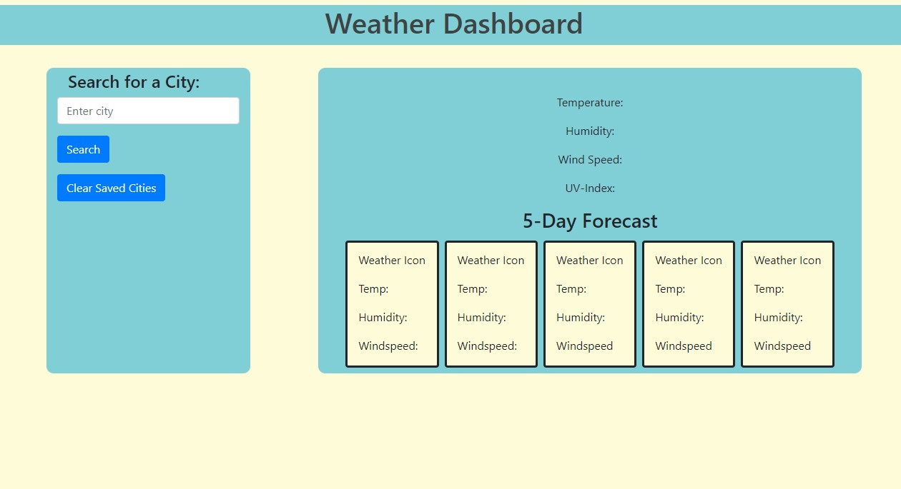
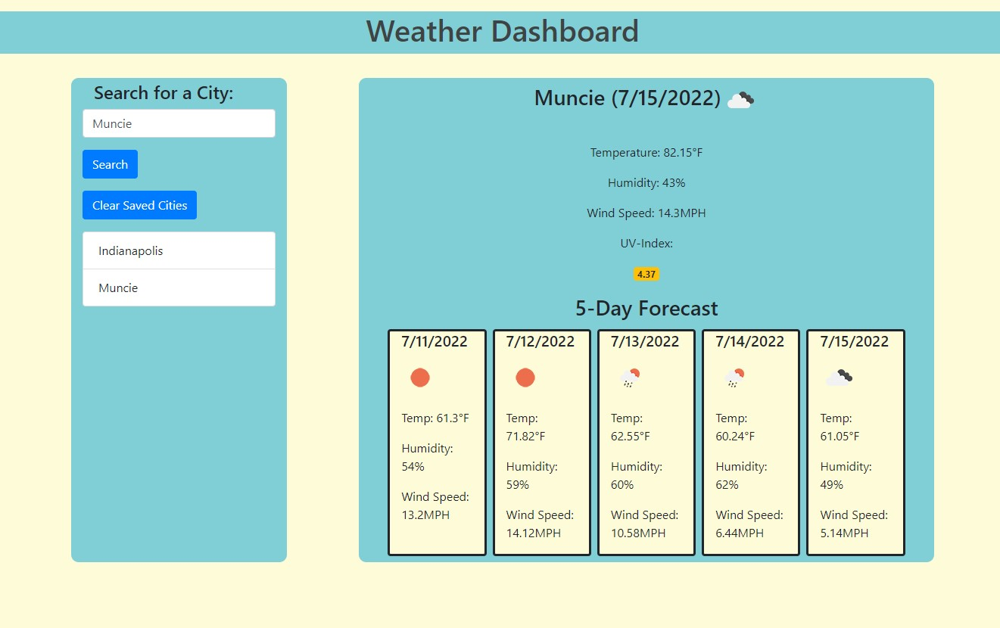

# Weather Dashboard

https://montelchuu.github.io/unique-weather-dashboard/

### Summary
* Weather dashboard to show weather for today and the next 5 days
* Shows temperature, humidity, wind speed and UV index

### The project layout
* The user can input their city and search for the weather
* The user can click on past cities to display the weather
* The user can see the UV index change color based on how hight the UV Index is

* City Example

### Features
* HTML
* CSS
* JS
* Bootstrap
* JQuery
